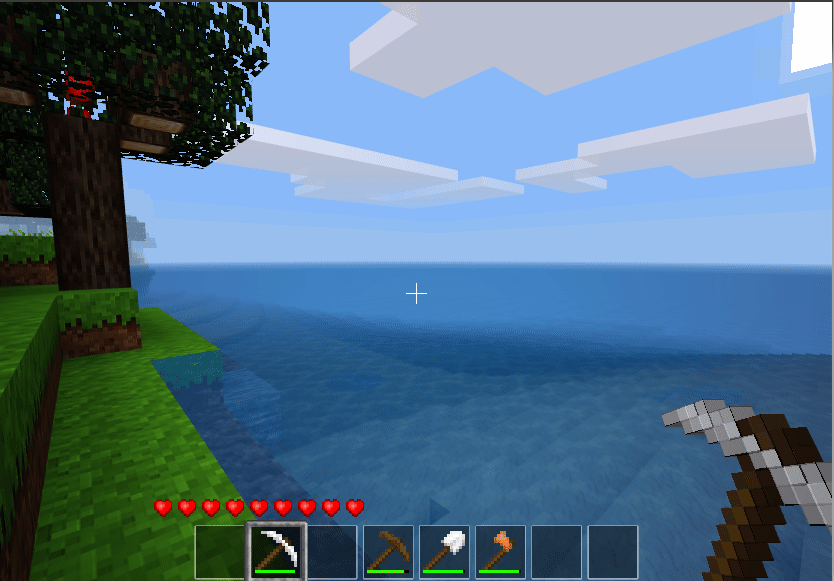

# Inventory cycle for Minetest

Mechanism and item to cycle through rows of inventory.

Cycles rows of inventory upwards/downwards into the top row - access different lines of your inventory without opening the inventory screen!



## Use

* Hold both the sprint and sneak buttons (typically `E` and `Shift`) to cycle through rows repeatedly
    * Only when stationary
    * By default, every 0.4 second
        * configurable per player via `/icycler period <N>`

## Item

You can also craft and use a cycling tool to explicitly cycle through rows on-click. It is more precise than the keypress based method (which can be affected by lag), but requires to change wielded item to use.

* Left-click move rows upward.
    * The active (top) row becomes the bottom row, and each other row is moved up
    * Items in the same column as the cycler tool do not get moved
* Right-click when pointing at a node, or drop (`Q`), to move rows downward

The inventory cycling tool can be made by combining three block types, in a diagonal pattern:

```
t = group:tree - any tree trunk
a = group:sand - any sand
o = group:stone - any stone 

[t] [ ] [ ]
[ ] [a] [ ]
[ ] [ ] [o]

or

[ ] [ ] [t]
[ ] [a] [ ]
[t] [ ] [ ]

```

## Settings

* `inventory_cycler.default_player_cycle_interval` Player inventory cycle invterval (how fast, in seconds, to switch through rows) - default `0.4`
* `inventory_cycler.must_stand_still` - whether the player must stand still to cycle, or if can be moving at the same time - default `true`
* `inventory_cycler.default_global_cycle_interval` - Global step interval (performance related, player cycle interval should be a multiple of this) - default `0.2`

## License

* Code: (C) 2019 Tai "DuCake" Kedzierski
    * Provided un der the terms of the LGPLv3
* Media: (C) 2019 Tai "DuCake" Kedzierski
    * Provided under the terms of CC-BY-SA-4.0
